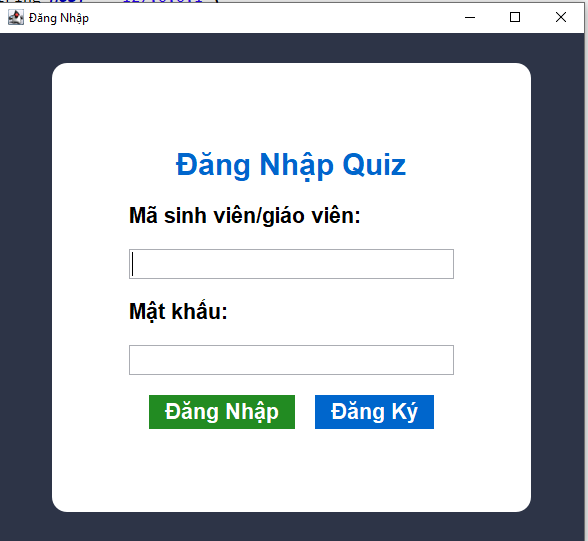
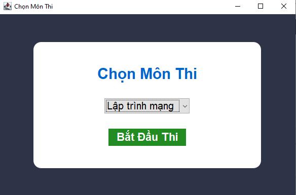
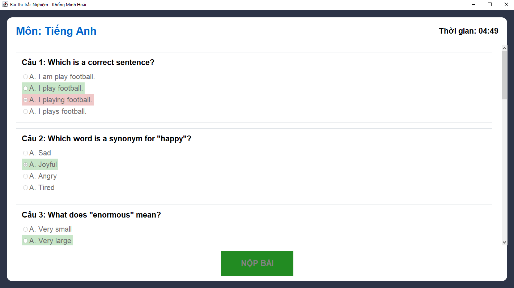
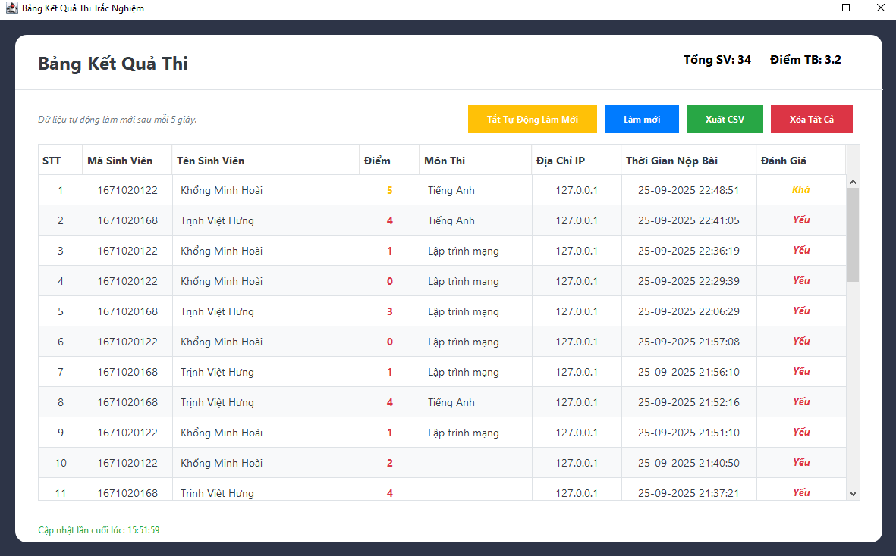

<h2 align="center">
    <a href="https://dainam.edu.vn/vi/khoa-cong-nghe-thong-tin">
    🎓 Faculty of Information Technology (DaiNam University)
    </a>
</h2>
<h2 align="center">
   ỨNG DỤNG TRẮC NGHIỆM TRỰC TUYẾN
</h2>
<div align="center">
    <p align="center">
        
        
        
    </p>

[](https://www.facebook.com/DNUAIoTLab)
[](https://dainam.edu.vn/vi/khoa-cong-nghe-thong-tin)
[](https://dainam.edu.vn)

</div>

# 📖 1. Giới thiệu
Ứng dụng Trắc nghiệm trực tuyến Client–Server được phát triển bằng Java, dựa trên giao thức TCP nhằm đảm bảo việc trao đổi dữ liệu tin cậy và chính xác. Hệ thống cho phép sinh viên/kỹ thuật viên kết nối tới server, thực hiện làm bài trắc nghiệm và nhận kết quả ngay sau khi hoàn thành.

Hệ thống đáp ứng các yêu cầu cơ bản của một bài thi trực tuyến:

📌 Client kết nối đến server:

    Kết nối qua địa chỉ IP và port (mặc định: 5000).

    Server hỗ trợ nhiều client đồng thời thông qua cơ chế đa luồng.

    Yêu cầu người dùng nhập tên để xác định danh tính.

📌 Gửi và nhận câu hỏi – đáp án:

    Server gửi các câu hỏi trắc nghiệm đến client.

    Người dùng chọn đáp án và gửi về server.

    Server kiểm tra và phản hồi kết quả đúng/sai theo thời gian thực.

📌 Quản lý kết quả:

    Server lưu trữ điểm số của từng sinh viên vào cơ sở dữ liệu MySQL.

    GUI admin hiển thị IP và điểm số theo thời gian thực.

📌 Client GUI trực quan:

    Giao diện đẹp, scroll mượt, thân thiện với người dùng.

    Nút submit sẽ disable sau khi nộp bài.

    Hiển thị điểm số cuối cùng ngay trên client.

🔹 Ý nghĩa ứng dụng:
    Hệ thống giúp sinh viên và nhà phát triển:

    Hiểu cơ chế Client–Server và truyền nhận dữ liệu tin cậy qua TCP.

    Thực hành triển khai ứng dụng Java đa luồng.

    Rèn luyện kỹ năng thiết kế GUI và lưu trữ dữ liệu MySQL.

    Làm nền tảng mở rộng cho các ứng dụng khảo thí trực tuyến và phân tích kết quả học tập.


# 🔧 2. Công nghệ sử dụng  

[](https://www.oracle.com/java/technologies/javase-downloads.html) 
[](https://docs.oracle.com/javase/tutorial/uiswing/) 
[](https://www.mysql.com/) 
[](https://www.eclipse.org/) 


# 🚀 3. Một số hình ảnh của hệ thống

<p align="center">
  
</p>

<p align="center">
  <em>Hình 1: Giao diện đăng nhập</em>
</p>

<p align="center">
  
</p>
<p align="center">
  <em>Hình 2: Chọn môn thi</em>

</p>

<p align="center">
  
</p>
<p align="center">
  <em>Hình 3: Bài thi</em>
</p>
  
</p>

<p align="center">
  
</p>
<p align="center">
  <em>Hình 4: Kết quả thi mà giáo viên quản lí</em>
</p>


# ⚡ 4. Các bước cài đặt

### 🔧 Bước 1: Chuẩn bị môi trường
- ☕ Cài đặt **JDK 8 hoặc 11**  
- 🗄️ Cài đặt **MySQL 8.x + Workbench**  
- 🛠️ Tạo **database `BTLQuiz`**

---
### 🗄️ Bước 2: Tạo bảng trong MySQL
- Import file SQL tạo bảng `questions` và `results` (hoặc chạy script tạo thủ công).  

---

### 📦 Bước 3: Thêm thư viện JDBC
- 📥 Tải **`mysql-connector-j-8.x.x.jar`**  
- 📂 Copy vào thư mục **`lib/`** của project  
- ➕ Chuột phải chọn **Add to Build Path** trong IDE

---

### ⚙️ Bước 4: Cấu hình kết nối
        Trong file **`DbHelper.java`**:  
        
        ```java
        public class DbHelper {
            private static final String URL = "jdbc:mysql://127.0.0.1:3306/BTLQuiz?serverTimezone=UTC";
            private static final String USER = "root";
            private static final String PASS = "your_password";
        
            public static Connection open() throws Exception {
                return DriverManager.getConnection(URL, USER, PASS);
            }
        }
🔑 Thay your_password bằng mật khẩu MySQL của bạn.

### ▶️ Bước 5: Chạy hệ thống

## 🖥️ Chạy **Server**
- Mở **`QuizServer.java`** → nhấn **Start Server 🟢**  
- 🌐 Server sẽ chạy trên **cổng `5000`**  

---

## 💻 Chạy **Client**
- Mở **`QuizClient.java`** → nhấn **Run 🚀**  
- 🔗 Client sẽ kết nối tới **`localhost:5000`**  
- 📝 Giao diện **làm bài thi** sẽ xuất hiện nếu đăng nhập tài khoản sinh viên
- 📝 Giao diện **quản lí điểm** sẽ xuất hiện nếu đăng nhập tài khoản giáo viên


---

## 🎯 Sử dụng hệ thống
1. ✍️**Đăng nhập** (hoặc đăng ký nếu là lần đầu) bằng tài khoản của bạn  
2. 📖 Chọn **môn thi** bạn muốn và hoàn thành các câu hỏi 
3. 📤 Nhấn **Nộp bài** để xem kết quả và đáp án chi tiết
 

---

        ### 🗄️ Kiểm tra dữ liệu trong MySQL Workbench
        
        SELECT * FROM questions;
        SELECT * FROM results;


# 🔧 5. Liên hệ (cá nhân)

**Họ tên**: Khổng Minh Hoài

**Lớp**: CNTT 16-04

**Email**: khonghoai.15052004@gmail.com

© 2025 AIoTLab, Faculty of Information Technology, DaiNam University. All rights reserved.


---


